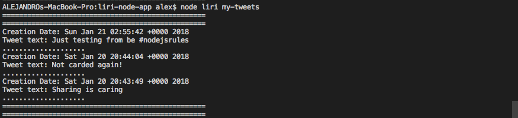

# liri-node-app

## What is it?
LIRI is like iPhone's SIRI. 
However, while SIRI is a Speech Interpretation and Recognition Interface, LIRI is a _Language_ Interpretation and Recognition Interface. LIRI will be a command line node app that takes in parameters and gives you back data.

The application responds to 3 commands:

	* my-tweets
	* spotify-this-song
	* movie-this

Refer to the [**Show Me**](#show-me) section below for examples on how to use each of the views.

## How do I use it?

Clone this repository and then run:

`npm install`

Then, to run the applicaton run:

`node liri [command + value Ex. movie-this Frozen]`

## Show Me

After executing `node liri command + value`, depending on command you will be presented with a list of items relative of command + value.

## Movie-this Command

When the Movie-this command is executed, the app will make a request to OMDB API to get information about the movie passed in as value.

## My-tweets Command

When the My-tweets command is executed, the app will make a request to Twitter API to get your tweets.

## Spotify-this-song Command

When the Spotify-this-song command is executed, the app will make a request to SPOTIFY API to get information about the song passed in as value.

